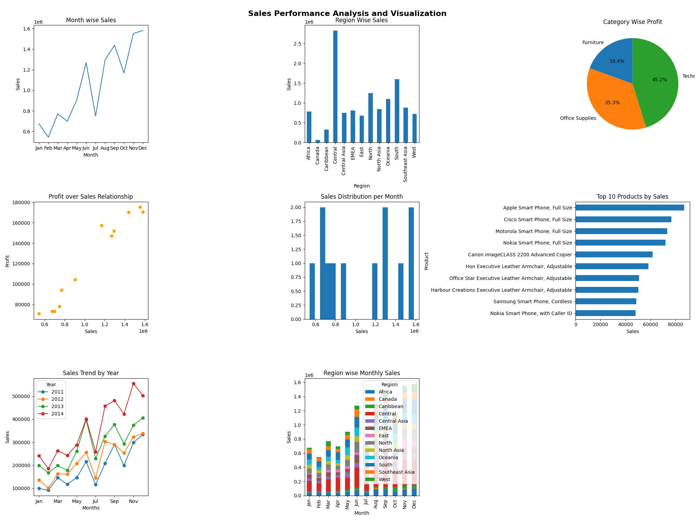
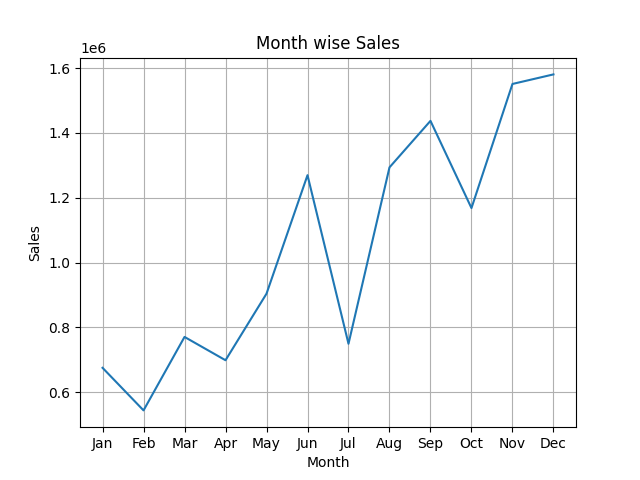
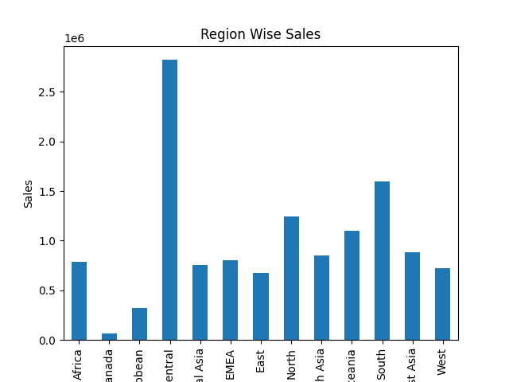
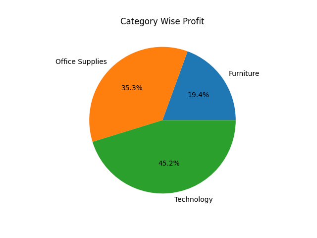
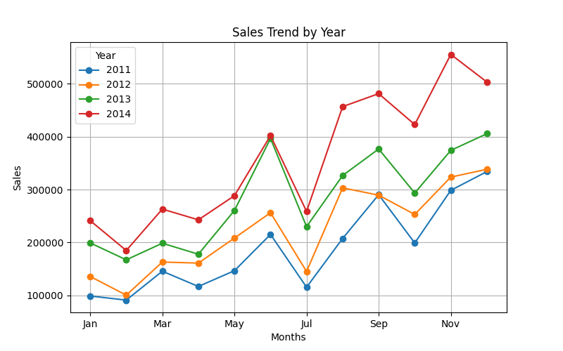

# 📊 Sales Performance Analysis & Visualization using Matplotlib

## 📌 Project Overview

This project leverages **Python (Matplotlib)** to perform end-to-end sales data analysis and create an interactive dashboard using multiple visualizations. It uncovers key business insights such as sales trends, regional performance, product profitability, and customer behavior to support data-driven decision-making.


--


## Table of Contents

1. [Objectives](#-objectives)
2. [Dashboard Preview](#-dashboard-preview)
3. [Key Insights](#-key-insights)
4. [Business Recommendations](#-business-recommendations)
5. [Key Visualizations](#-key-visualizations)
6. [Dataset Information](#-dataset-information)
7. [Dataset Link](#-dataset-link)
8. [Tools & Technologies](#tools--technologies)
9. [Data Cleaning & Preparation](#-data-cleaning--preparation)
10. [Visualizations Included (EDA)](#-visualizations-included-eda)
11. [Project Structure](#-project-structure)
12. [How to Run](#how-to-run)
13. [Author](#author)


--


## 🎯 Objectives

- Analyze monthly and yearly sales trends.
- Compare region-wise perfromamce.
- Evaluate category-wise profitabiliye.
- Identify Top-Performing Products.
- Study sales distrbution and variability.
- Analyze relationship between sales and profit.


--


## 📷 Dashboard Preview



---

## 🔑 Key Insights

- Sales peak significantly during **year-end months(Q3 & Q4)**, driven by seasonal demand and major sales events.
- **Technology category dominates profitability**, contributing the **45.2%** of total profit.
- A few products (e.g., smartphones & copiers) act as **major revenue and profit drivers**.
- **Central region generates the highest sales**, indicating strong market performance.
- Strong correlation observed between **sales and profit**, highlighting high-margin opportunities.


--


## 🚀 Business Recommendations

- Plan marketing campaigns and inventory for **peak sales seasons (Q3 & Q4)**.
- Focus on **high-profit categories like Technology** to maximize margins.
- Promote and bundle **top-performing products** to increase revenue.
- Expand operations and marketing in **high-performing regions**.
- Optimize pricing and discount strategies based on **sales-profit relationship**.


--

## 📉 Key Visualizations

The following visualizations support the insights and recommendations derived from the analysis:

### 📌 Sales Trend


**Insight:** Sales shw an overall upward trend with noticable peak toward the end of the year, indicating strong seasonal demand.

**Impact:** Business should increase inventory and marketing efforts during peak months (Nov-Dec) to maximize revenue.

### 📌 Region-wise Sales


**Insight:** A few regions (likely West/East) contributes significantly higher sales, while others undereperforming.

**Impact:** Focus expansion and marketing in high-performing regions while imporving startegy in low-performing areas to balance growth.

### 📌 Category Profit Distribution


**Insight:** Technology contributes the highest profit (~45%), followed by Office Supplies, while Furniture has the lowest share.

**Impact:** Prioritize high-margin categories like Technologies for low-profit segments like Furniture.

### 📌 Sales Trend by Years


**Insight:** Sales have grown consistently year-over-year, indicating strong business expansion and increasing demand.

**Impact:** Supports long-term investment and scaling strategies, as the business shows sustainable growth momentum.

--


## 📌 Dataset Information
Dataset contains:
- Row ID, Order ID, Product ID, Product Name.
- Order Date, Ship Date, Ship Month.
- Customer ID, Customer Name.
- Segment, Category, Sub-Category.
- Country, State, Region, City, Postal Code.
- Market, Shipping Cost, Order Priority.
- Sales, Quantity, Discount, Profit.


---


## 📌 Dataset Link
Dataset: (https://www.kaggle.com/datasets/shekpaul/global-superstore/data)


---


## Tools & Technologies
- Python
- NumPy
- Pandas
- Matplotlib
- Jupyter Notebook
- VS Code


--


## 🧹 Data Cleaning & Preparation

- Data Type Checked.
- Checking Duplicates and Removed Duplicates.
- Checking for Null Values and Handle them by dropping.
- Fixed Date Time Column.
- Created Month Column.


---


## 📊 Visualizations Included (EDA)
- Sales Trend (Monthly & Yearly)
- Region-wise Sales Comparison
- Category-wise Profit Distribution
- Top Products by Sales
- Sales vs Profit Relationship
- Sales Distribution Patterns


---


## 📂 Project Structure

Project-forler/
- Sales_dashboard.ipynb
- dataset.xlsx
- README.md
- dashboard.png


---


## How to Run
```bash
pip install pandas matplotlib numpy
python sales_dashboard.ipynb
```


---


## Author

Dhammadeep Gajbhiye
Aspiring Data Analyst | Python | Power BI | SQL

LinkedIn: (https://linkedin.com/in/dhammadeep-gajbhiye-57b38b16a/)
GitHub: (https://github.com/dhammdeepgajbhiye32)


---


## ⭐ If you like this project

Give it a star ⭐ on GitHub — it helps showcase the project!